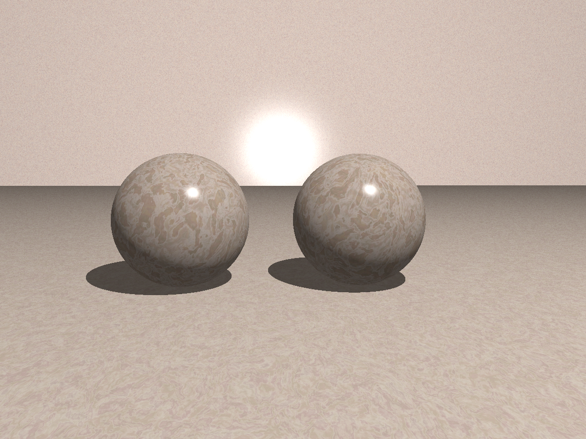

# pyray
Resources for ray tracing in python with POV-Ray.

Ray traced with povray using [vapory](https://github.com/Zulko/vapory). Script available [here](https://gist.github.com/ronojoy/bd6c15603f7f39c6d10d)

## Tutorials
- [POV-Ray "Getting Started"](http://www.povray.org/documentation/view/3.6.1/13/)
- [Friedrich Lohmuller](http://www.f-lohmueller.de/homepage.htm)
- [Mike Williams](http://www.econym.demon.co.uk/)
- [Christoph Hormann](http://www.imagico.de/raytracing.html)

